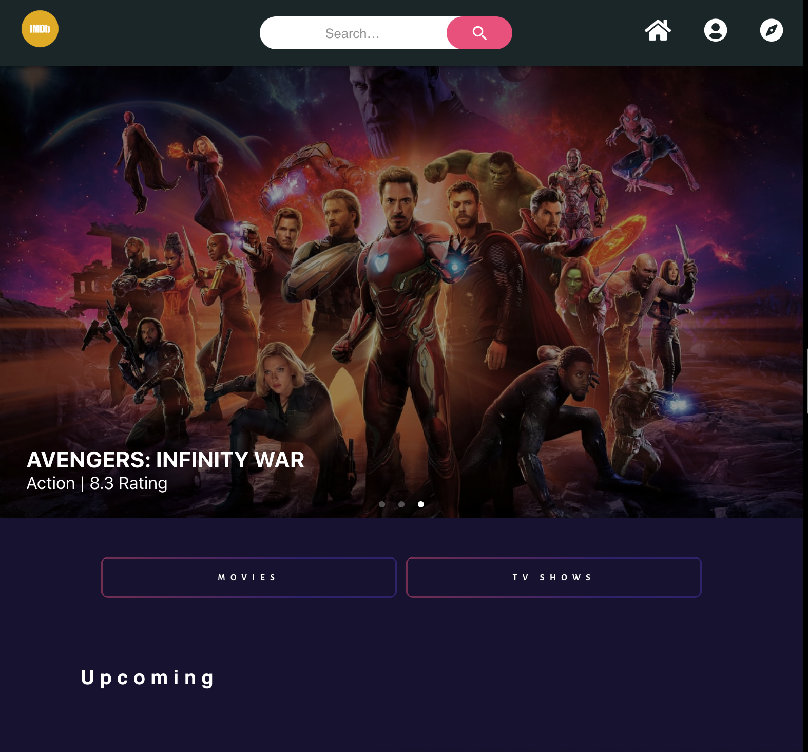

# Movie Search Db19 🔥🔥🔥🔥🔥🔥🔥

### Functionalities that need to be done.

1. [x]jb - Login Page
   - [x] Login functionality
   - [x] Browse as Guest functionality

2) Home Page
   - [] Buttons that switch home page content between Movies/TV
   - [] Four sections of movies (Upcoming, popular, now playing, top rated) with pagination
   - [] Four sections of TV (Airing today, popular, on the air, top rated) with pagination
   - [] Search functionality

3. Individual Movie/TV Page
   - [] Need to pull **data** from API for: poster, background img, summary, name, rating, genre, cast, trailers.
   - [] Styling and animations
   - [] OPTIONAL: social media share functionality & heart functionality
   - [] Back to home button (maybe make the menu on top sticky?)

4) Cast Member Page
   - [] Need to pull data for: picture, name, biography, birthday, past movies
   - [] Styling and animations

5. Discover Page

   - [] Advanced search using filters (popularity rating, year of release, genre, keyword). From the filmcloud website it looks like only year of release and first filter work.
   - [] A list of 20-30 movies with their posters, titles, and rating, most likely ordered by release date/popularity. Add pagination to this functionality with previous/next buttons.

6. Member Page (optional)
   - [] Add sections for favorite movies, tv shows, movies you've rated, tv shows you've rated
   - [] Log out button
   - [] Profile picture

---

## Stretch

- [] Add pagination on infinite carousels
- [] Add Socials Login Option \*etc (fb, twitter , github, google)

## Authors

- John Benedict Miranda
- Christian Allen
